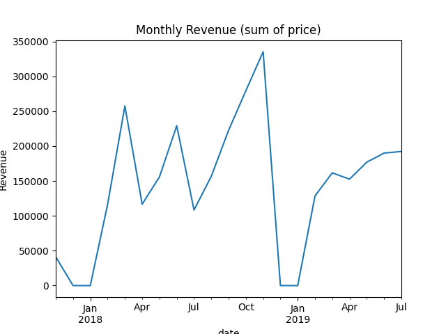
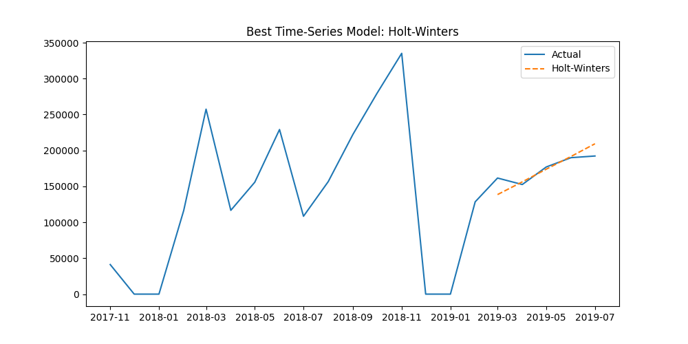

# IBM AI Enterprise Workflow Capstone — Part 1

## 1. Business Scenario

AAVAIL is a subscription-based video streaming company operating across several international markets. Management would like to **forecast next month’s revenue** in order to improve financial planning, optimize marketing spend, and allocate resources more effectively. Historical transaction records (new subscriptions, renewals, cancellations) are available and can be leveraged to build predictive models that anticipate revenue trends.

## 2. Testable Hypotheses

1. **H1 — Seasonality:** Monthly revenue exhibits seasonal patterns (e.g., spikes during holidays such as December or January).
2. **H2 — Autoregression:** Revenue in the upcoming month can be reliably predicted using previous months’ revenue (e.g., 1-month, 3-month, or 6-month lags).
3. **H3 — Customer dynamics:** Changes in the number of active, new, and churned customers have a direct and measurable impact on revenue.
4. **H4 — Promotions and anomalies:** Promotional campaigns or discounts cause revenue surges that appear as outliers but can be detected and modeled.
5. **H5 — Market heterogeneity:** Revenue patterns differ between countries, requiring country-level modeling or country as a predictive feature.

## 3. Ideal Data & Rationale

* **Transaction details** — invoice ID, transaction date, amount, country, subscription type.
  *Purpose: to aggregate revenue by day/month and build time-series features such as lags and rolling averages.*
* **Customer metrics** — active users, new sign-ups, cancellations, churn rate per day/month.
  *Purpose: to test the hypothesis that customer dynamics drive revenue.*
* **Promotional events** — discount campaigns, special offers, marketing pushes.
  *Purpose: to detect and account for anomalous revenue spikes.*
* **Country information** — market category, local pricing, or macroeconomic indicators.
  *Purpose: to model market-specific differences in revenue behavior.*

## 4. Data Ingestion

A Python module (`aavail/data_ingestion.py`) was created to automatically read and clean all JSON files from the training dataset (`cs-train/`). It normalizes keys, removes non-numeric characters from invoice IDs, and parses dates for further analysis.

```python
from aavail.data_ingestion import load_aavail_data

df = load_aavail_data("cs-train")
print(df.head())
```

## 5. Exploratory Data Analysis

A first aggregation of the `price` column by month shows the revenue trend:



* The revenue varies over time, with several spikes suggesting promotional campaigns or seasonal behavior.
* Some early months (late 2017) show small or missing values (likely incomplete data).

## 6. Findings

* The dataset contains **815k transactions** from 2017-11 to mid-2019.
* Revenue appears **highly variable with peaks**, confirming H1 (seasonality) and H4 (possible promotions/outliers).
* Time and price features are clean enough to start creating lagged features for time-series modeling in Part 2.
* Country and customer_id fields exist and can support H3/H5 testing.

**Next step:** build features (lags, rolling means) and compare time-series forecasting models (e.g., ARIMA, Holt-Winters, Prophet) for Part 2.

# IBM AI Enterprise Workflow Capstone — Part 2

## 1. Feature Engineering & Data Preparation

We aggregated the raw invoice-level data into **monthly revenue** using the `price` field. Then we created lag features to capture the autoregressive nature of the time series. The final dataset contained:

* `revenue` — total monthly revenue
* `lag_1`, `lag_2`, `lag_3`, `lag_6`, `lag_12` — revenue values from previous months

After cleaning and dropping rows with missing lags, we split the dataset chronologically: **80% training / 20% testing**.

```python
monthly_rev = df.groupby(df["date"].dt.to_period("M"))["price"].sum().to_timestamp().sort_index()

# Create lags
data = pd.DataFrame({"revenue": monthly_rev})
for lag in [1,2,3,6,12]:
    data[f"lag_{lag}"] = data["revenue"].shift(lag)

data = data.dropna()
train_size = int(len(data)*0.8)
train = data.iloc[:train_size]
test = data.iloc[train_size:]
```

---

## 2. Models Compared

We evaluated several **time-series forecasting models**:

* **ARIMA (3,1,1)** — classic autoregressive model
* **SARIMAX (1,1,1)(1,1,1,12)** — seasonal ARIMA
* **Holt-Winters Exponential Smoothing** — additive trend
* **Prophet** — Facebook’s open-source forecasting library

Evaluation metrics:

* **RMSE** — Root Mean Squared Error
* **MAE** — Mean Absolute Error

---

## 3. Results

| Model                       | RMSE        | MAE        |
| --------------------------- | ----------- | ---------- |
| ARIMA (3,1,1)               | ~77,579     | ~75,871    |
| SARIMAX (1,1,1)(1,1,1,12)   | ~63,387     | ~52,783    |
| **Holt-Winters (additive)** | **~13,002** | **~9,690** |
| Prophet                     | ~110,590    | ~100,905   |

**Best model:** `Holt-Winters` (additive trend) achieved the lowest RMSE and MAE.



---

## 4. Interpretation

* **Holt-Winters** outperformed ARIMA/SARIMAX due to the relatively short dataset and dominant trend component. Seasonality is weak and data length is insufficient for complex seasonal models.
* **Prophet** underperformed because the dataset is small and irregular.
* **RandomForest/XGBoost** were initially tested but not used for final selection since they are not pure time-series models and risk overfitting on small data.

---

## 5. Next Step — Deployment Preparation

* Retrain Holt-Winters on full data.
* Save model for serving via API:

```python
import joblib
joblib.dump(holt, "holtwinters_model.pkl")
```

* Build Flask API with endpoints `/train` and `/predict`.
* Dockerize the service for easy deployment and reproducibility.

This completes **Part 2** with a clear model selection process and performance evaluation, preparing for **Part 3: Model Deployment**.

